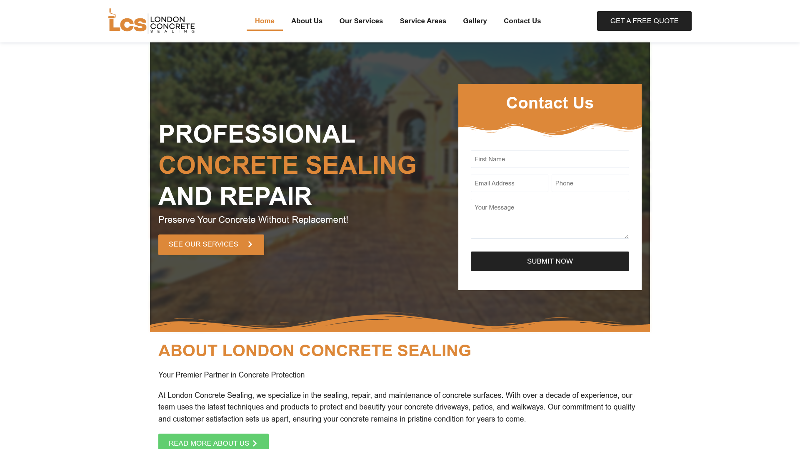

# DESIGN.md: London Concrete Sealing (original)

## Source
- URL: https://londonconcretesealing.ca/ (original WordPress/Elementor site)
- Captured via: Wayback Machine snapshot `20240925065523`
- Capture date: 2026-05-29
- Evidence: Firecrawl `branding` tokens + viewport screenshot + page markdown/rawHTML; image inventory from CDX API

## Reference Screenshot

Visual source of truth for layout. Tokens below describe the same page in machine-readable form.

## Design Summary
A classic local-contractor Elementor layout: white sticky header with a wide horizontal logo and a dark "GET A FREE QUOTE" pill button. A full-bleed hero photo (sealed driveway) with a dark left-to-transparent overlay carries a bold uppercase headline where the middle line ("CONCRETE SEALING") is amber-orange. A white contact-form card floats over the right of the hero; its header is an amber band with a wavy bottom edge and a black "SUBMIT NOW" button. Body sections alternate white / light-grey, headings are uppercase amber, secondary CTAs are bright green pills. Corners are mostly square (0px radius). Typography is Poppins throughout.

## Design Tokens

### Colors
- `--primary` (amber-orange): `#DD8839` — headline accent word, hero CTA, form header band, section eyebrows
- `--primary-dark` (hover): `#c4742c`
- `--secondary` (slate): `#334155` — dark sections, body-dark text
- `--accent` (green): `#61CE70` — secondary action buttons ("READ MORE", links)
- `--accent-dark`: `#4eb85d`
- `--ink` (near-black buttons): `#1a1a1a` — "GET A FREE QUOTE", "SUBMIT NOW"
- `--text`: `#222222`
- `--bg`: `#FFFFFF`
- `--bg-muted`: `#F1F5F9` (slate-100) for alternating sections
- Border: `#E2E8F0`

### Typography
- Family: **Poppins** (Google), weights 400/500/600/700; `display: swap`
- Headings: uppercase, bold (700), tight tracking; H2 large (~40–60px)
- Body: 16–18px, line-height ~1.7, regular weight
- Eyebrow labels: uppercase, semibold, amber, letter-spaced

### Spacing And Layout
- Base unit 4px; section vertical rhythm ~80px (`py-20`)
- Container max-width ~1140px (`max-w-6xl`)
- Border radius: **square** by default (0–2px). Inputs 2px. Buttons square or 2px.
- Shadows: soft card shadow on the floating form only; flat elsewhere

## Components
- **Header**: white, sticky, ~80px tall. Left: horizontal logo image (`/images/logo.png`, ~2244×671). Right: nav (Home, About Us, Our Services ▾, Service Areas ▾, Gallery, Contact Us) + black "GET A FREE QUOTE" pill.
- **Hero**: full-bleed background photo (`/images/concrete-sealing-driveway.jpg`) with `linear-gradient(to right, rgba(0,0,0,.75), rgba(0,0,0,.15))`. Uppercase H1 in white with amber middle word. Amber "SEE OUR SERVICES" button. Floating white form card on the right (desktop) / stacked (mobile).
- **Form card**: white, amber header band with wavy bottom, fields First Name / Email / Phone / Message, black full-width "SUBMIT NOW".
- **Buttons**: primary = amber fill / white text / square; secondary = green fill / white text; tertiary = black fill (quote/submit). Min 44px tall.
- **Service cards**: photo on top, square corners, uppercase amber title, short body.
- **Why / What-makes-us-different**: icon + uppercase title + body, on white or slate.
- **FAQ**: simple accordion rows.
- **Footer**: slate/dark with logo, nav, service areas, contact email.

## Page Patterns
Home section order: Header → Hero(+form) → About → Why Concrete Sealing (3 cols) → Our Services (cards) → What Makes Us Different (4) → Pricing CTA → Questions form → Service Areas → FAQ → Closing CTA → Footer.

## Content Style
Voice: professional, reassuring, benefit-led. CTAs: "GET A FREE QUOTE", "SEE OUR SERVICES", "READ MORE ABOUT US". Headings uppercase. Tagline: "Preserve Your Concrete Without Replacement!".

## Agent Build Instructions
Re-skin the existing Next.js app (do not rebuild routes):
1. Swap font to Poppins via `next/font/google`.
2. Set CSS variables above in `globals.css`; default square corners.
3. Rebuild the home hero as a full-bleed photo with dark gradient + amber-accented uppercase H1 + floating contact-form card.
4. Use the downloaded `/images/*` for hero, service cards, and gallery; logo image in the navbar; favicon.
5. Primary buttons amber, secondary buttons green, quote/submit buttons black.
6. Keep all existing routes/URLs intact (no broken links).

## Rerun Inputs
workflow: firecrawl-website-design-clone
source_url: https://londonconcretesealing.ca/ (via Wayback 20240925065523)
target_stack: Next.js + Tailwind v4 + Supabase + Vercel (monorepo apps/london-concrete-sealing)
output: DESIGN.md
