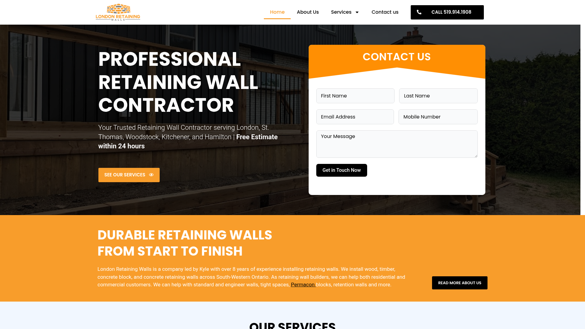

# DESIGN.md: London Retaining Walls

## Source
- URL: https://londonretainingwalls.ca
- Capture date: 2026-05-27
- Evidence: Firecrawl branding JSON, full-page screenshot, page markdown

## Reference Screenshot


Use this screenshot as the visual source of truth for layout, hierarchy, density, and feel.

## Design Summary
Clean, professional contractor site with a **dark-image hero split-layout**: left side bold white uppercase heading + CTA, right side inline white contact form card with orange header. Strong orange (#F89D2B) accent throughout. White-background body sections. Poppins headings (bold, uppercase), Roboto body. Orange CTAs on dark, dark CTAs on light. Full-width orange banner section after hero.

---

## Design Tokens

### Colors
| Token | Value | Usage |
|---|---|---|
| `--accent` | `#F89D2B` | Primary CTA buttons, section backgrounds, highlights |
| `--accent-hover` | `#E08920` | Hover state for orange buttons |
| `--dark` | `#1C2833` | Dark text, hero overlays, footer background |
| `--dark-mid` | `#334155` | Nav links, secondary text, icon backgrounds |
| `--light-bg` | `#F4F6F8` | Alternating section backgrounds |
| `--text` | `#1a1a1a` | Body text |
| `--text-muted` | `#6F757E` | Subtext, captions |
| White | `#FFFFFF` | Backgrounds, reversed text |

### Typography
| Token | Value |
|---|---|
| Heading font | Poppins (Google Fonts, weights 600 700 800) |
| Body font | Roboto (Google Fonts, weights 400 500) |
| H1 size | 3.5rem–4rem, uppercase, font-weight 800 |
| H2 size | 2rem–2.5rem, uppercase, font-weight 700 |
| H3 size | 1.25rem, font-weight 600 |
| Body size | 1rem (16px), line-height 1.7 |
| Letter spacing on headings | 0.05em (tracking-wide) |

### Spacing and Layout
| Token | Value |
|---|---|
| Base unit | 4px |
| Container max-width | 1200px |
| Section padding | py-16 (64px) |
| Card border-radius | 4px (minimal, tight) |
| Input border-radius | 6px |
| Hero min-height | 560px |

---

## Components

### Header
- White background, sticky
- Logo left (image, ~180px wide)
- Nav links center: Home, About Us, Services (dropdown), Contact Us
- Right: Orange pill button "CALL 519.914.1908" with phone icon
- Mobile: hamburger → full-width dropdown menu

### Hero (Split Layout)
- Full-width, min-height 560px
- Background: dark-tinted photo of retaining wall/stone work
- Left half (text side):
  - Eyebrow: small white text with separator
  - H1: Large bold uppercase white — "PROFESSIONAL RETAINING WALL CONTRACTOR"
  - Subtitle: white text with service cities + "Free Estimate within 24 hours"
  - CTA: Orange button "SEE OUR SERVICES →"
- Right half (form card):
  - White card with orange header bar "CONTACT US"
  - Compact inline form: First Name / Last Name, Email / Mobile, Message
  - Orange submit button "Get in Touch Now"

### Orange Banner Section
- Full-width orange (#F89D2B) background
- Two-column: large H2 white text left, body text + "Read More About Us" dark button right
- Used for the "DURABLE RETAINING WALLS FROM START TO FINISH" intro section

### Service Cards
- White background, subtle shadow or border
- Image (or icon) at top
- H3 heading
- Body text
- "Read More →" link in accent color

### Trust/Differentiators Grid
- 3 columns × 2 rows of icon cards
- Icon top (orange), bold H3, paragraph text
- Light gray (#F4F6F8) background or white with borders

### Testimonial
- Simple centered block: italic quote in large text, attribution in small caps below

### Contact Form (full)
- Two-column grid: First + Last name, Email + Phone, then full-width message + file upload
- Orange submit button
- Minimal border inputs with light gray fill

### Footer
- Dark background (#1C2833)
- Logo + tagline left
- Contact info (email, phone, hours) center-left
- Services links + nav links columns right
- Social icons row
- Copyright bar at bottom

---

## Page Patterns

**Homepage section order:**
1. Header (sticky)
2. Hero (split: dark image left text + right form card)
3. Orange banner — company intro (DURABLE RETAINING WALLS)
4. Services grid (4 cards)
5. Testimonial quote
6. Residential vs Commercial (two column)
7. Wall types (bullet points section)
8. Differentiators (6 icon cards)
9. Contact form section
10. Service areas (two column list)
11. FAQ accordion
12. Footer

---

## Content Style
- Headings: ALL CAPS or Title Case, bold, declarative
- CTAs: Action-oriented — "SEE OUR SERVICES", "GET A FREE ESTIMATE", "GET IN TOUCH NOW"
- Body copy: clear, professional, contractor-focused. No jargon overload.
- Testimonial: first-person, attributed with name and location

---

## Agent Build Instructions
1. Set `--accent: #F89D2B` and `--dark: #1C2833` in globals.css CSS variables
2. Import Poppins (600, 700, 800) and Roboto (400, 500) via `next/font/google` in layout.tsx; apply font variables to `<body>`
3. Apply `font-[family-name:var(--font-poppins)]` to all headings, `font-[family-name:var(--font-roboto)]` to body
4. All H1/H2 headings: uppercase, tracking-wide, font-bold/extrabold
5. Hero: `min-h-[560px]` grid with 2 cols on lg+. Left: dark image bg + gradient overlay + white text. Right: white card with orange header
6. Orange sections: `bg-[var(--accent)]` with white text
7. Buttons: `.btn-accent` = `bg-[var(--accent)] text-white hover:bg-[var(--accent-hover)]`, `.btn-dark` = `bg-[var(--dark)] text-white hover:opacity-90`
8. Cards: white bg, `shadow-md rounded`, border-none
9. Nav header: white bg, `shadow-sm`, logo left, links center, orange call button right

## Rerun Inputs
```
workflow: firecrawl-website-design-clone
source_url: https://londonretainingwalls.ca
target_stack: Next.js 16 / Tailwind CSS v4
output: DESIGN.md
```
